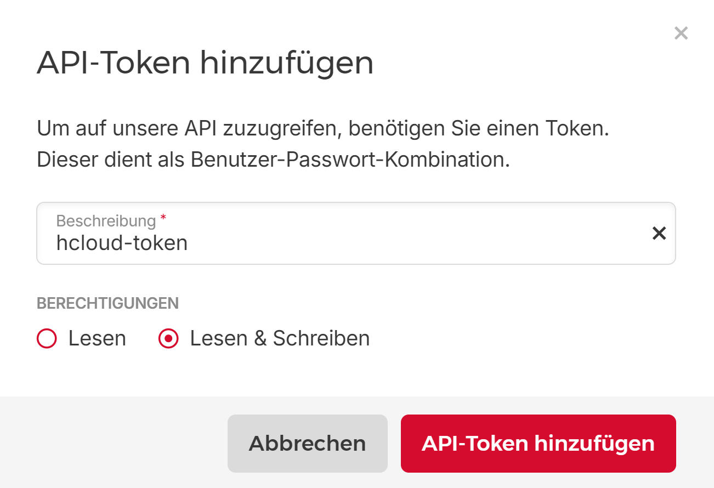

# hetzner-k8s-cluster
Installation of a Kubernetes cluster in the Hetzer Cloud


## Create a Hetzner account
First of all, we need a [Hetzner account](https://accounts.hetzner.com/) to set up our infrastructure in the Hetzner Cloud.

## Create a project
Login to the [Hetzner Cloud](https://console.hetzner.cloud/) with your new account and create a project.

The resources are always attached to a project.

Click on "+ NEW PROJECT" and enter a project name (e.g. Kubernetes).

## Install Hetzner CLI (hcloud) on your local machine
hcloud is a command-line interface for the Hetzner Cloud. 

See [GitHub - hetznercloud/cli: A command-line interface for Hetzner Cloud](https://github.com/hetznercloud/cli) for the installation of the Hetzner CLI.

On macOS and Linux, you can install hcloud via Homebrew
```shell
brew install hcloud
```
On Windows, you can install hcloud via Scoop
```shell
scoop install hcloud
```

## Create an API TOKEN
Now that we have installed hcloud on our computer, we need to generate an API token.

To do this, we click on the key "Security" in the bar on the left and then on "API TOKENS" at the top and then on "GENERATE API TOKEN".

We have to set the permissions to "Read & Write" and click on "GENERATE API TOKEN".



## Create hcloud context
Copy the API token to the clipboard and create a hcloud context:

Example context: Kubernetes

```shell
hcloud context create Kubernetes
# Paste the API token into stdin prompt
```
## Generate an SSH key on your local machine for remote access to the Hetzner servers
Generate an SSH key (public key available under ~/.ssh/id_rsa.pub)
```shell
ssh-keygen
```
Create ssh-key in our hcloud context Kubernetes 
```shell
hcloud ssh-key create --name ssh --public-key-from-file ~/.ssh/id_rsa.pub
```
## Generate the infrastructure for our Kubernetes cluster
The following commands give you an overview of the available Hetzner ressources:

List of all server types
```shell
hcloud server-type list
```
List of all Hetzner locations
```shell
hcloud location list
```
List of all images
```shell
hcloud image list
```
#### Create a private network
Usage:
  hcloud network create [options] --name <name> --ip-range <ip-range>

```shell
hcloud network create --name network-1 --ip-range 172.16.0.0/24
hcloud network add-subnet network-1 --network-zone eu-central --type server --ip-range 172.16.0.0/24
```

#### Create two servers (k8s-cp-01 and k8s-wrk-01)
Usage:
  hcloud server create [options] --name <name> --type <server-type> --image <image>

```shell
hcloud server create --name k8s-cp-01 --type cx21 --image ubuntu-22.04 --location nbg1 --network network-1 --ssh-key ssh
hcloud server create --name k8s-wrk-01 --type cx51 --image ubuntu-22.04 --location nbg1 --network network-1 --ssh-key ssh
```

## SSH into your Server
Now we can get the public IP of our servers with the hcloud cli.

```shell
hcloud server list
```
```
#Output
ID         NAME         STATUS    IPV4            IPV6                      PRIVATE NET              DATACENTER   AGE
46991060   k8s-cp-01    running   49.13.148.237   2a01:4f8:c0c:2b8a::/64    172.16.0.2 (network-1)   nbg1-dc3     1m
46991111   k8s-wrk-01   running   49.12.236.99    2a01:4f8:1c1b:4fa9::/64   172.16.0.3 (network-1)   nbg1-dc3     20s
```
Once we get the IP address of the servers, we can log in to the nodes via SSH.

k8s-cp-01:
```shell
ssh root@49.13.148.237
```
k8s-wrk-01:
```shell
ssh root@49.12.236.99
```

## Update Server components (on all Nodes)
First we update the operating system.
```shell
apt update
apt upgrade
reboot
```

## Install Ansible on k8s-cp-01
Login to k8s-cp-01 with your SSH key
```shell
ssh root@49.13.148.237
```
Create the project and kubernetes directory
```shell
mkdir projects
cd projects
mkdir kubernetes
cd kubernetes
```

Clone the kubespray repository (in projects/kubernetes)
```shell
git clone https://github.com/kubernetes-sigs/kubespray.git
```

Install Ansible
```shell
VENVDIR=kubespray-venv
KUBESPRAYDIR=kubespray
python3 -m venv $VENVDIR
source $VENVDIR/bin/activate
cd $KUBESPRAYDIR
pip install -U -r requirements.txt
cd ~
```

## Kubernetes Cluster Installation with KUBESPRAY (on the server k8s-cp-01)

Name of our Kubernetes inventory (example): avalon-k8s

Copy inventory/sample as inventory/avalon-k8s (inventory files for new Kubernetes Cluster) 
```shell
cd projects/kubernetes/kubespray
cp -rfp inventory/sample inventory/avalon-k8s
```

Create the hosts inventory file with inventory builder

Control Plane: k8s-cp-01 (172.16.0.2)

Worker Node: k8s-wrk-01 (172.16.0.3) 

```shell
apt install python3-pip
pip install ruamel.yaml
declare -a IPS=(172.16.0.2 172.16.0.3)
CONFIG_FILE=inventory/avalon-k8s/hosts.yaml python3 contrib/inventory_builder/inventory.py ${IPS[@]}
```

Edit the hosts.yaml file
```shell 
cd ~/projects/kubernetes/kubespray/inventory/avalon-k8s
nano hosts.yaml
```
Change the node names as follows:
```yaml
# hosts.yaml
all:
  hosts:
    k8s-cp-01:
      ansible_host: 172.16.0.2
      ip: 172.16.0.2
      access_ip: 172.16.0.2
    k8s-wrk-01:
      ansible_host: 172.16.0.3
      ip: 172.16.0.3
      access_ip: 172.16.0.3
  children:
    kube_control_plane:
      hosts:
        k8s-cp-01:
    kube_node:
      hosts:
        k8s-cp-01:
        k8s-wrk-01:
    etcd:
      hosts:
        k8s-cp-01:
    k8s_cluster:
      children:
        kube_control_plane:
        kube_node:
    calico_rr:
      hosts: {}
```

Review and change parameters under ~/projects/kubernetes/kubespray/inventory/avalon-k8s/group_vars

Change settings for all.yml
```shell
cd ~/projects/kubernetes/kubespray/inventory/avalon-k8s/group_vars/all
nano all.yml
```
Change the following lines:
```yaml
# all.yml
## There are some changes specific to the cloud providers
## for instance we need to encapsulate packets with some network plugins
## If set the possible values are either 'gce', 'aws', 'azure', 'openstack', 'vsphere', 'oci', or 'external'
## When openstack is used make sure to source in the openstack credentials
## like you would do when using openstack-client before starting the playbook.
cloud_provider: external

## When cloud_provider is set to 'external', you can set the cloud controller to deploy
## Supported cloud controllers are: 'openstack', 'vsphere', 'huaweicloud' and 'hcloud'
## When openstack or vsphere are used make sure to source in the required fields
external_cloud_provider: hcloud
```

Change settings for hcloud.yml
```shell
cd ~/projects/kubernetes/kubespray/inventory/avalon-k8s/group_vars/all
nano hcloud.yml
```
Change the following lines (replace YOUR_HETZNER_API_TOKEN with your own hcloud token):
```yaml
# hcloud.yml
## Values for the external Hcloud Cloud Controller
external_hcloud_cloud:
  hcloud_api_token: "YOUR_HETZNER_API_TOKEN"
  token_secret_name: hcloud
  with_networks: true   
  network_name: network-1 
  service_account_name: cloud-controller-manager
  controller_image_tag: "latest"
```

Change settings for k8s-cluster.yml
```shell
cd ~/projects/kubernetes/kubespray/inventory/avalon-k8s/group_vars/k8s_cluster
nano k8s-cluster.yml
```
Change the following lines (name the cluster as you like, in our case the cluster name is avalon-k8s.local):
> Use Cilium as cni plugin because it works well with the Hetzner Cloud Controller Manager.
```yaml
# k8s-cluster.yml
# Choose network plugin (cilium, calico, kube-ovn, weave or flannel. Use cni for generic cni plugin)
# Can also be set to 'cloud', which lets the cloud provider setup appropriate routing
kube_network_plugin: cilium
...
# Kubernetes cluster name, also will be used as DNS domain
cluster_name: avalon-k8s.local
```

Change settings for addons.yml
```shell
cd ~/projects/kubernetes/kubespray/inventory/avalon-k8s/group_vars/k8s_cluster
nano addons.yml
```
Change the following lines (enable helm, the docker registry (if you need the registry) and the metrics server:
```yaml
# addons.yml
#Helm deployment
helm_enabled: true

#Registry deployment
registry_enabled: true
#registry_namespace: kube-system
#registry_storage_class: ""
#registry_disk_size: "10Gi"

# Metrics Server deployment
metrics_server_enabled: true
# metrics_server_container_port: 10250
# metrics_server_kubelet_insecure_tls: true
# metrics_server_metric_resolution: 15s
# metrics_server_kubelet_preferred_address_types: "InternalIP,ExternalIP,Hostname"
# metrics_server_host_network: false
# metrics_server_replicas: 1
```

> Create an SSH key on the server k8s-cp-01 and add the public key to the file authorized_keys on the server k8s-cp-01 and the server k8s-wrk-01.
```shell
#On the server k8s-cp-01
ssh-keygen
cat ~/.ssh/id_rsa.pub >> ~/.ssh/authorized_keys
#Copy the public key ~/.ssh/id_rsa.pub to the server k8s-wrk-01 (with your preferred method (e.g. WinSCP or something similar))
#On the server k8s-wrk-01
#Append the copied public key to the file ~/.ssh/authorized_keys
```
Deploy Kubespray with Ansible Playbook - run the playbook as root 
The option `--become` is required, as for example writing SSL keys in /etc/, 
installing packages and interacting with various systemd daemons. 
Without --become the playbook will fail to run!
```shell
ansible-playbook -i inventory/avalon-k8s/hosts.yaml --become --become-user=root cluster.yml
```
The cluster installation takes approx. 15-20 minutes.

KUBESPRAY tests all cluster components during the installation.

Notes:

You can reset the cluster with
```shell
ansible-playbook -i inventory/avalon-k8s/hosts.yaml --become --become-user=root reset.yml
```
or you can scale the cluster (e.g. additional nodes) with
```shell
ansible-playbook -i inventory/avalon-k8s/hosts.yaml --become --become-user=root scale.yml
```
You can find more information at [Kubespray](https://kubespray.io/#/).
