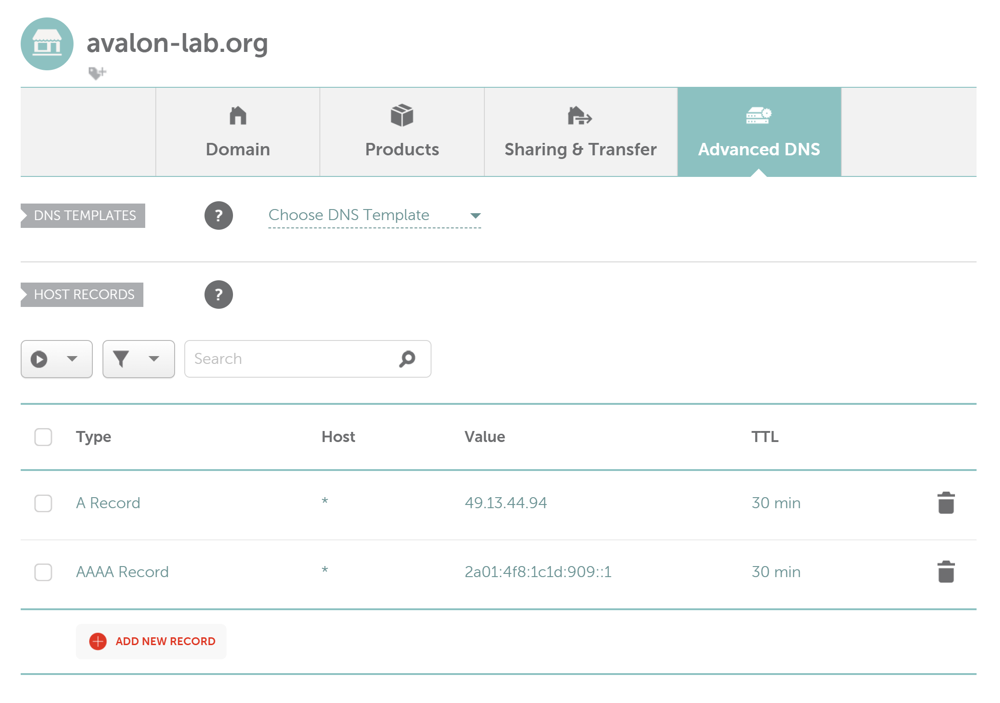

## Install the NGINX Ingress Controller

Create an ingress-values.yaml (with the necessary annotations).	

The Hetzner Cloud Controller Manager watches Services with `type: LoadBalancer` and creates Hetzner Cloud Load Balancers for them, adds Kubernetes Nodes as targets for the Load Balancer.

We use several Hetzner load balancer annotations in our ingress-values.yaml file so that the Load Balancer is created in the way we want.

You can find detailed information at [Hetzner Load Balancers](https://github.com/hetznercloud/hcloud-cloud-controller-manager/blob/main/docs/load_balancers.md).

```shell
nano ingress-values.yaml
```
```
# ingress-values.yaml
controller:
  replicaCount: 1
  service:
    enabled: true
    type: LoadBalancer
    annotations:
      load-balancer.hetzner.cloud/location: nbg1
      load-balancer.hetzner.cloud/disable-private-ingress: "true"
      load-balancer.hetzner.cloud/use-private-ip: "true"
      load-balancer.hetzner.cloud/name: "kubelb1"
  resources:
    limits:
      cpu: "250m"
      memory: "250Mi"
    requests:
      cpu: "100m"
      memory: "100Mi"
  ingressClassResource:
    name: nginx
    enabled: true
    default: true
    controllerValue: "k8s.io/ingress-nginx"
  ingressClassByName: true
```
Add the ingress-nginx helm repository
```shell
# Adds the Helm Repository
helm repo add ingress-nginx https://kubernetes.github.io/ingress-nginx
# Updates the Cached repositories
helm repo update
```
Deploy the ingress-controller

```shell
helm upgrade --install ingress-nginx ingress-nginx/ingress-nginx -f ingress-values.yaml --namespace ingress-nginx --create-namespace
```

We will use `upgrade -install` so that an existing installation will also be updated with new parameters.  `ingress-nginx` is the Name of our installation. `ingress-nginx/ingress-nginx` is the name of the repository.  `-f ingress-values.yaml` are the values we apply to the helm chart deployment. `--namespace ingress-nginx` is the namespace where we deploy the helm chart into.  `--create-namespace` creates the Namespace if it does not exist.

Check the ingress-nginx service

```shell
kubectl get svc -n ingress-nginx
```
```
#Output
NAME                                 TYPE           CLUSTER-IP     EXTERNAL-IP                        PORT(S)                      AGE
ingress-nginx-controller             LoadBalancer   10.233.19.48   2a01:4f8:1c1d:909::1,49.13.44.94   80:32597/TCP,443:31605/TCP   126m
ingress-nginx-controller-admission   ClusterIP      10.233.53.61   <none>                             443/TCP                      126m
```
Check the created load balancer

```shell
hcloud load-balancer list
```
```
#Output
ID        NAME      HEALTH    IPV4          IPV6                   TYPE   LOCATION   NETWORK ZONE   AGE
1837713   kubelb1   healthy   49.13.44.94   2a01:4f8:1c1d:909::1   lb11   nbg1       eu-central     5h
```
### Point your domain to the load balancer

Now that we have deployed the ingress-nginx and obtained a load balancer through the hcloud-cloud-controller-manager, we can point our domain to the load balancer's IPs.

So you can go to the Domain Registrar of your choice and set the A-Record to the IPV4 and the AAA-Record to the IPV6 of the load balancer.

I used the Domain Registrar Namecheap to purchase the inexpensive domain avalon-lab.org for this purpose and set the wildcard A-Record to 49.13.44.94 and the wildcard AAA-Record to 2a01:4f8:1c1d:909::1 (see picture below).



