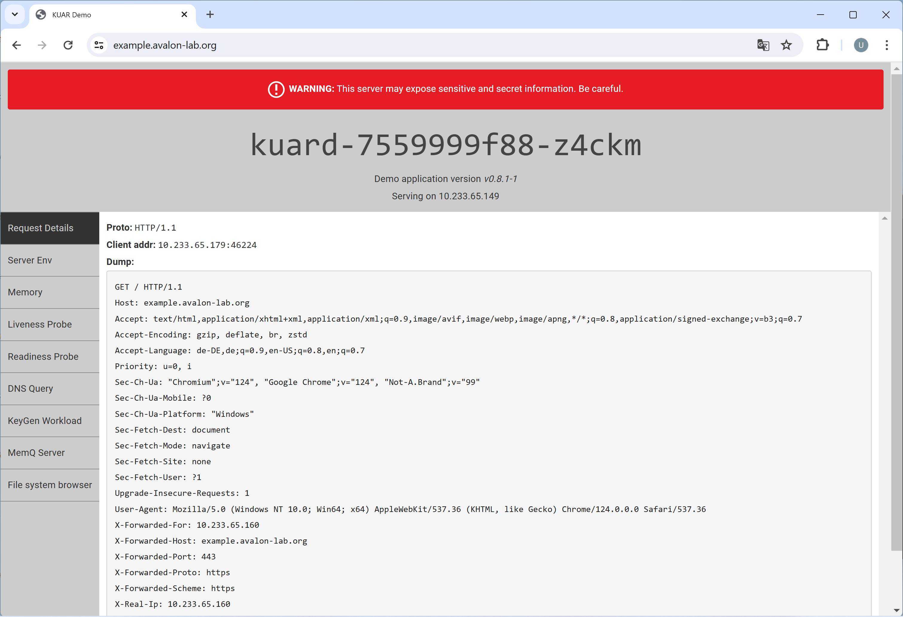

## Create the app kuard (for testing)

Prerequisites:
Cert-Manager and Ingress-Nginx must be installed

```shell
nano kuard.yaml
```
```
# kuard.yaml
apiVersion: apps/v1
kind: Deployment
metadata:
  name: kuard
spec:
  selector:
    matchLabels:
      app: kuard
  replicas: 1
  template:
    metadata:
      labels:
        app: kuard
    spec:
      containers:
      - image: gcr.io/kuar-demo/kuard-amd64:1
        imagePullPolicy: Always
        name: kuard
        ports:
        - containerPort: 8080
---
apiVersion: v1
kind: Service
metadata:
  name: kuard
spec:
  ports:
  - port: 80
    targetPort: 8080
    protocol: TCP
  selector:
    app: kuard
---
apiVersion: networking.k8s.io/v1
kind: Ingress
metadata:
  name: kuard
  annotations:
    cert-manager.io/issuer: "letsencrypt-prod"

spec:
  ingressClassName: nginx
  tls:
  - hosts:
    - example.avalon-lab.org
    secretName: quickstart-example-tls
  rules:
  - host: example.avalon-lab.org
    http:
      paths:
      - path: /
        pathType: Prefix
        backend:
          service:
            name: kuard
            port:
              number: 80
```
Apply the app

```shell
kubectl apply -f kuard.yaml
```
List the certificate

```shell
kubectl get certificate
```
```
#Output
NAME                     READY   SECRET                   AGE
quickstart-example-tls   True    quickstart-example-tls   92m
```
List the certificate info

```shell
kubectl describe certificate quickstart-example-tls
```
```
#Output
Name:         quickstart-example-tls
Namespace:    default
Labels:       <none>
Annotations:  <none>
API Version:  cert-manager.io/v1
Kind:         Certificate
Metadata:
  Creation Timestamp:  2024-05-09T07:56:16Z
  Generation:          1
  Owner References:
    API Version:           networking.k8s.io/v1
    Block Owner Deletion:  true
    Controller:            true
    Kind:                  Ingress
    Name:                  kuard
    UID:                   72f957f0-e707-46aa-b6b8-99382ae12a79
  Resource Version:        358293
  UID:                     a662c9a7-3751-4090-89a9-e56a0f35e1de
Spec:
  Dns Names:
    example.avalon-lab.org
  Issuer Ref:
    Group:      cert-manager.io
    Kind:       Issuer
    Name:       letsencrypt-prod
  Secret Name:  quickstart-example-tls
  Usages:
    digital signature
    key encipherment
Status:
  Conditions:
    Last Transition Time:  2024-05-09T07:56:42Z
    Message:               Certificate is up to date and has not expired
    Observed Generation:   1
    Reason:                Ready
    Status:                True
    Type:                  Ready
  Not After:               2024-08-07T06:56:38Z
  Not Before:              2024-05-09T06:56:39Z
  Renewal Time:            2024-07-08T06:56:38Z
  Revision:                1
Events:                    <none>
```
List all pods

```shell
kubectl get pods -A
```
```
#Output
NAMESPACE       NAME                                        READY   STATUS    RESTARTS   AGE
...
default         kuard-7559999f88-z4ckm                      1/1     Running   0          93m
...
```
List all services

```shell
kubectl get svc -A
```
```
#Output
NAMESPACE       NAME                                 TYPE           CLUSTER-IP      EXTERNAL-IP                        PORT(S)                      AGE
...
default         kuard                                ClusterIP      10.233.35.37    <none>                             80/TCP                       94m
...
```
Test the kuard app with Google Chrome:



